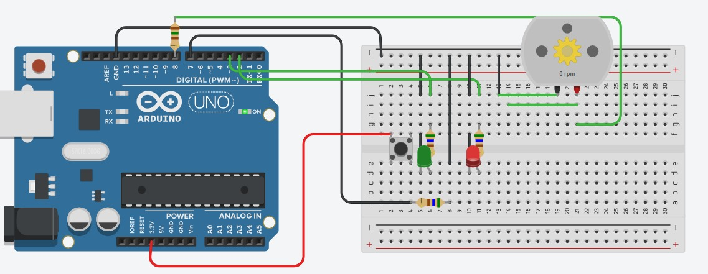

# Projeto-Arduino
Projeto que envolve tanto Hardware quanto Software.

## Grupo
- [Juan Henriques Passos](https://github.com/JuanHPassos)
- Kattryel
- Marcos Cota
- Keren

## Informações
- **Disciplina:** Eletrônica para Computação
- **Professor:** Eduardo do Valle Simões
- **Curso:** Bacharelado em Ciência da Computação
- **Turma:** BCC-B / 2024

## Projeto

## Lista de Componentes

| Quantidade | Componentes                  | Valor (R$) |
|------------|------------------------------|------------|
| 1x         | Protoboard 400 pontos     | [R$12,50](https://www.baudaeletronica.com.br/produto/protoboard-400-pontos.html)     |
| 1x         | LED 5mm Vermelho             | [R$0,25](https://www.baudaeletronica.com.br/produto/led-difuso-5mm-vermelho)     |
| 1x         | LED 5mm Verde                | [R$0,25](https://www.baudaeletronica.com.br/produto/led-difuso-5mm-verde)    |
| 1x         | Arduino Uno + Cabo USB 2.0   | [R$70,00](https://www.baudaeletronica.com.br/produto/arduino-uno-r3.html)    |
| 1x         | Jumpers        | [R$14,80](https://www.baudaeletronica.com.br/buscar?q=junmpers)    |
| 1x        | Chave Táctil 6x6x4,3mm 4 Terminais  | [R$00,25](https://www.baudaeletronica.com.br/produto/chave-tactil-6x6x43mm-4-terminais.html)   |
| 1x         | Motor de Passo + Drive ULN2003   | [R$29,00](https://www.baudaeletronica.com.br/produto/motor-de-passo-drive-uln2003.html)     |
| 2x         | Resistor 560 ohm             | [R$00,50x2 = R$01,00](https://produto.mercadolivre.com.br/MLB-4414488984-kit-de-resistores-14w-560-unidades-56-valores-na-maleta-_JM#position=7&search_layout=grid&type=item&tracking_id=278db833-3cb6-49ba-b34c-e3577864dad3)
| **Total**  |                              | **R$113,25** |

## Funcionamento dos Componentes
- Placa Arduino: São placas de circuito impresso que contêm um microcontrolador, interfaces de entrada/saída (I/O) e pinos de conexão para facilitar a interação com componentes eletrônicos externos. Nesse contexto, o Arduino faz a interligação do circuito com o motor de passo.
- Cabo USB 2.0: faz a conexão entre o computador com código programado em Arduino e a placa Arduino Uno.
- Protoboard: placa de ensaio projetada para facilitar a montagem e teste de circuitos eletrônicos. Neste caso,em conjunto com os jumpers,ela auxilia a conectar eletricamente o circuito.
- Jumpers: referem-se a fios ou conectores utilizados para estabelecer conexões entre componentes eletrônicos, pinos ou pontos específicos em um circuito. Neste caso, foram utilizados jumpers do tipo macho/macho e macho/fêmea, de forma a interligar o Arduino, a protoboard, e ao motor de passo por meio do Drive ULN2003.
- Chave Táctil: Uma chave táctil é um tipo de interruptor que detecta toque ou pressão suave, usado para enviar sinais elétricos em dispositivos eletrônicos, como controles remotos e painéis de controle. Ela permite uma interface de usuário simples e compacta para ativar ou desativar funções. Nessa caso, ela liga desliga o motor.
- LED Verde: Representa que o motor está ligado e girando.
- LED Vermelho: Representa que o motor está desligado.
- Motor de Passo: Um motor de passos funciona convertendo pulsos elétricos digitais em movimentos mecânicos incrementais. Ele é composto por um rotor (imã permanente) e um estator com várias bobinas eletromagnéticas. Quando as bobinas são energizadas em uma sequência específica, elas criam campos magnéticos que atraem ou repelem o rotor, causando sua rotação em pequenos ângulos discretos, chamados de passos. Controladores de motor de passos gerenciam a sequência e a velocidade dos pulsos, permitindo movimentos precisos e repetíveis, essenciais em aplicações como impressoras 3D e máquinas CNC. Nesse projeto, apenas usamos desse giro para exibir produtos.

## Protótipo do Circuito - Tinkercad

